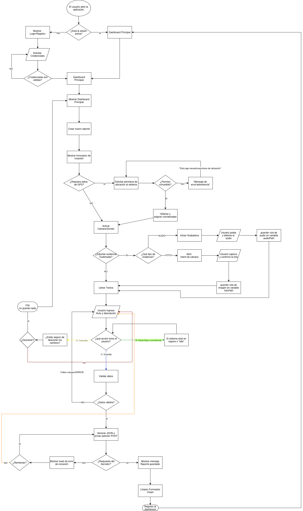

# Aplicación de Reportes de Campo 🌳 (SistemaReportes)

Este proyecto representa la implementación completa de un sistema móvil para la gestión de incidentes y el seguimiento geolocalizado, desarrollado en **Java para Android**. El código sigue una arquitectura modular diseñada para ser escalable y de fácil mantenimiento (Play Store ready).

## 🚀 Requisitos Cumplidos

* ✅ **10 Activities Funcionales:** Implementación de 10 pantallas distintas.
* ✅ **CRUD Completo y Persistente:** Funcionalidad de Crear, Leer, Actualizar y Eliminar reportes utilizando **SQLite** interna.
* ✅ **Integración de Hardware:** Uso dedicado y seguro de la **Cámara**, **Grabadora de Audio** y **GPS**.
* ✅ **Arquitectura Profesional:** Estructura modular **Modelo-Vista-Controlador/Servicio** (UML).

---

## 🏗️ Arquitectura y Estructura del Proyecto

### **Diagramas de Diseño**

**(Las imágenes deben estar en la misma carpeta que este archivo: README.md)**

### Diagrama de Clases (UML)
 

### Diagrama de Flujo (Creación de Reporte)

-----

**¡El proyecto ha sido subido correctamente a GitHub\!**
